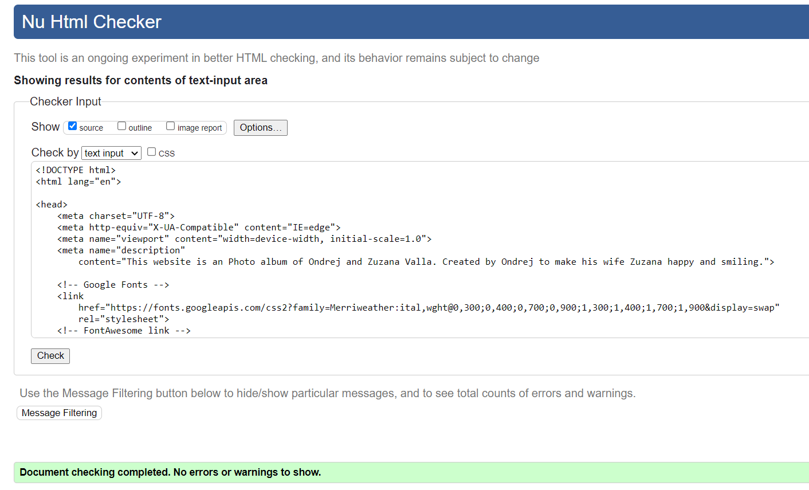
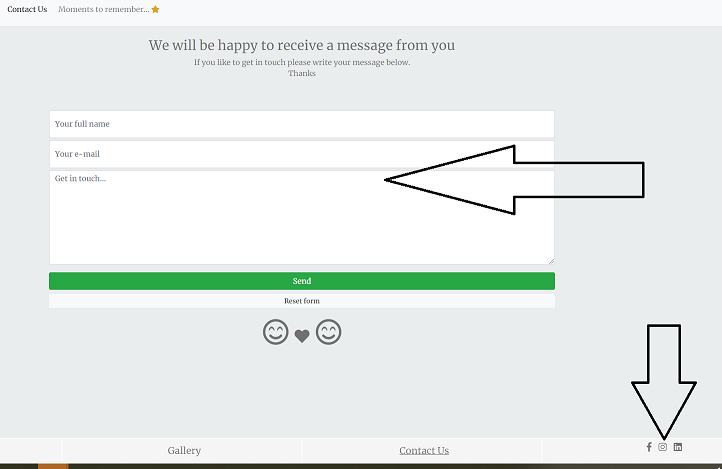

# Zuzana and Ondrej photos

## Welcome to our photos website

### Please [click this link](https://ondrejvalla.github.io/z-o-photo-album/index.html) if you like to see the live website.

#### This website was created as my Second Milestone project with Code Institute. 
As mentioned in the intro of the landing page, my wife Zuzana and I enjoy going on holiday. However as there are restrictions for traveling at the moment (current year 2021) our way to get to the holiday mood again is by looking at our holiday pictures and then enjoy the sunshine in the garden. We always go through folders on our computer. Zuzana was suggesting many times, that it would be great to have holiday pictures in one place. That is why I decided to create this gallery website as my MS2 project. 

## Table of Contents
> - [Overview](#overview)
> - [User Experience](#user-experience)
> - [Features](#features)
> - [Technologies Used](#technologies-used)
> - [Testing](#testing)
> - [Deployment](#deployment)
> - [Credits](#credits)

## Overview

Even though it is very likely, that the main two users of this website will be Zuzana and myself, other users can still find some features and interactivity like changing color buttons, gallery buttons, show/hide buttons, social links and contact page to get in touch or to send us some destinations suggestion. 

## User Experience

- [User Stories](#user-stories)
- [The Scope Plane](#the-scope-plane)
- [The Structure Plane](#the-structure-plane)
- [Wireframes](#wireframes)
- [The Surface Plane](#the-surface-plane)

### User Stories

- User story 1: I like to browse through these galleries easily whether on my PC or mobile.
- User story 2: I like to see each destination separately if possible.
- User story 3: I like it when websites are changing colors etc.
- User story 4: Would be great if I could contact Zuzana and Ondrej.
- User story 5: I would like to see Zuzana and Ondrej's social media.
- User story 6: I Ondrej Valla, would also like to use this website on the entertainment screen in my car, when I am driving with my wife, for a better car atmosphere.

### The Scope Plane

To enjoy a website like this, where the main focus is the Gallery of holidays, the layout must be simple and straightforward. Selected photographs must be loading quickly, must be of good quality and engaging to the user. 

### The Structure Plane

#### This website consist of five pages: index.html, gallery.html, contact.html, random.html and slideshow.html.

- Home page / Landing page (index.html) contains: 
1. Top Navbar changing to burger nav on smaller devices. 
2. Two buttons: Zuzana-pink Ondrej-blue which changes the color theme of the current page. 
3. Intro text.
4. A carousel of pictures of one of each of the destinations covered on this website. 
5. Google maps API of six destinations A B C D E F.
6. Six flipping cards with A B C D E F destinations. Each card has a front picture and after flipped three slide pictures + gallery link button.
7. The footer - Home Gallery Contact Us and Social links buttons.

- Gallery page (gallery.html) contains:
1. Top Navbar with a dropdown of all six destinations, changing to burger nav on smaller devices. 
2. Two buttons: Zuzana-pink Ondrej-blue which changes the color theme of the current page.
3. Six horizontally laid buttons for each destination.
4. A carousel: on load, all destinations slide show, after clicking the individual destination button, the destination slide show start.
5. The footer - Home Gallery Contact Us and Social links buttons.

- Contact Us page (contact.html) contains:
1. Top Navbar changing to burger nav on smaller devices.
2. Introduction "We will be happy to receive a message from you" changing to "Thank you for your message, Have a great day/evening (based on the time of the day)" 
3. Contact form: Full name, Email, and Textarea. All required. Send button and Reset form button.
4. Two smiling faces and heart from https://fontawesome.com. Little feature changing color while typing the message, by using keydown, keypress and keyup functions.
5. The footer - Home Gallery Contact Us and Social links buttons.

- Moments to remember... page (random.html) contains:
1. Top Navbar changing to burger nav on smaller devices.
2. Heading: Click *star* for the random image
3. Blue window with a yellow star. After the yellow star is clicked, a random picture display. 
4. The footer - Home Gallery Contact Us and Social links buttons.

- Slideshow page (slideshow.html) *Created FOR MY USE, please see **User story 6** for more details. Thanks.
  I created this page FOR MY USE. It can be accessed by direct link [https://ondrejvalla.github.io/z-o-photo-album/slideshow.html](https://ondrejvalla.github.io/z-o-photo-album/slideshow.html) or by clicking the hidden button located under random picture, in Moments to remember page (random.html).

### Wireframes:
 
- <a href="assets/wireframes/landing-page.png" target="_blank">Landing Page PC</a>
- <a href="assets/wireframes/landing-page-tablet.png" target="_blank">Landing Page Tablet</a>
- <a href="assets/wireframes/landing-page-mobile.png" target="_blank">Landing Page Mobile</a>

- <a href="assets/wireframes/gallery-page.png" target="_blank">Gallery Page PC</a>
- <a href="assets/wireframes/gallery-page-tablet.png" target="_blank">Gallery Page Tablet</a>
- <a href="assets/wireframes/gallery-page-mobile.png" target="_blank">Gallery Page Mobile</a>

- <a href="assets/wireframes/contact-page.png" target="_blank">Contact Page PC</a>
- <a href="assets/wireframes/contact-page-tablet.png" target="_blank">Contact Page Tablet</a>
- <a href="assets/wireframes/contact-page-mobile.png" target="_blank">Contact Page Mobile</a>

### The Surface Plane

I was aiming to create simple gallery website with some of our holiday pictures. 

- #### Images 
    - All images used on this website were taken by my wife Zuzana Valla or myself Ondrej Valla.

- #### Colours
    - Choosing colours for this website was quite easy. My wife's favourite colour is pink and mine is blue.
    - I was aiming to use a colour theme to match   
    - The main body background colour after page loads is a basic, darker shade of white rgba(234, 237, 238, 0.952).
    - Fonts colour is dark color: #3b3b3bb3.
    - Zuzana's style button change the background to light pink rgb(252, 230, 230). The second pink colour is a bit darker rgb(228, 161, 161).
    - Ondrej's style button change the background to light blue  rgb(130, 162, 209). The second blue colour is a bit darker rgb(23, 75, 126). 
    - The fonts colour changes after clicking the styles buttons to Whitesmoke for better readability.
    - The heart in the Header is changing from colour Black to colour Red with mouseover function.
    - The clickable star in random.html has primary colour Goldenrod, changing to Gold colour with onmouseenter function, and White colour after clicked.

- #### Icons
    - I used site Font Awesome to implement great icons. 
---

## Features

- #### Navigation bar
    - Navbar on the top of the page is probably the most traditional and the most user-friendly one.
    - On a mobile or tablet, the navbar is collapsed to the hamburger icon which expands when clicked
    - Users can click on the navbar brand to take them back to the home page.
    - In the Gallery page, the navbar features the dropdown menu with six links to individual destination galleries.

- #### Home page
    - Style buttons, Zuzana (pink) Ondrej (blue) which change the colour theme of the home page.
    - Intro text, which changes from general intro to Zuzana's intro and Ondrej's intro, based on the style button clicked.
    - Carousel slideshow with six pictures of six main destinations of this website.
    - Google Maps API, currently just a basic version, with six A B C D E F map drop points, including two clusters.
    - Six flippable cards of six A B C D E F destinations. Each card has the map drop point, name of the destination/gallery, picture of Zuzana and Ondrej from the destination and description of the holiday. 
    - When the card is clicked, the flip function does activate and the card flips.
    - Each flipped card has the button to the gallery page and a carousel with three pictures slideshow.
 
- #### Gallery page
    - Style buttons, Zuzana (pink) Ondrej (blue) which change the colour theme of the home page.
    - Six individual destination buttons for each gallery.
    - Bordered window with the carousel slideshow of clicked destination. 
    - User can change between pink and blue colour background while watching images. 

- #### Contact Us page
    - Introduction text: We will be happy to receive a message from you. If you like to get in touch please write your message below. Thanks
    - When the message is successfully sent, the introduction text change to: Thank You for your message. Have a great day! / Have a great afternoon! / Have a lovely evening! (based on the time of the day) Kind regards Zuzana and Ondrej.
    - If the message is not sent, the introduction text change to: There was a problem. Your message was not sent. Please try again, or contact us directly at ondrej.valla@gmail.com Thank you.
    - Send button changing to Sending... when sending a message.
    - Alerts pop up boxes when the message is successful and when is unsuccessful.
    - Fontawesome icons: Female icon, Male icon one heart icon changing colour when a message is being typed.
    - The message does not send as long as all the input fields are filled up.

- #### Moments to remember page
    - This page features a random image function. After the star is clicked, the star changes the color and a random image appears. If clicked again, another random image appears. 

- #### Future Improvements
    - It would be great to keep the selected theme applied for all pages once style buttons clicked.
    - More interactivity with the user similar to one in the contact.html.
    - I am planning to add even more galleries and possibly some video albums in the future.
    - There will definitely be more to improve once this website will be finished and I start to use it. 

---

## Technologies Used

#### Languages:
- [HTML](https://en.wikipedia.org/wiki/HTML)
- [CSS](https://en.wikipedia.org/wiki/CSS)
- [JavaScript](https://en.wikipedia.org/wiki/JavaScript)

#### Libraries:
- [Balsamiq](https://balsamiq.com/) for the wireframes.
- [Bootstrap 4.2.1](https://getbootstrap.com/) to use the grid system, carousels, pre-formatted features like buttons, collapsible navbar, etc.
- [FontAwesome](https://fontawesome.com/) for icons.
- [Google Fonts](https://fonts.google.com/) for fonts "Merriweather".
- [Favicon](https://favicon.io/) for the awesome icon on the browser tab.
- [jQuery](https://jquery.com/) for JavaScript features

#### Version Control:
- [Github](https://github.com/) - Used to store the code and use of Github Pages to deploy the website. 
- [Gitpod](https://gitpod.io/) - Used as the primary software for development and to push and commit code to Gihub.

#### Other:
- [Code Institute Course Content](https://courses.codeinstitute.net/) - Currently my primary source of learning knowledge.
- [ChromeDevTools](https://developers.google.com/web/tools/chrome-devtools) - Used frequently to detect any bugs or layout differences.
- [W3Schools](https://www.w3schools.com/) - used as a general resource for HTML, CSS , JavaScript coding tips.
- [Stackoverflow](https://stackoverflow.com) - used as a general resource for HTML, CSS , JavaScript coding tips.
- [AmIResponsive](http://ami.responsivedesign.is/) - Used to check how the layout of the website looks across different devices. 
- [Google Mobile-Friendly Test](https://search.google.com/test/mobile-friendly) - Used to test all pages on a mobile device
- [Google Maps](https://developers.google.com/maps) - Used for Google Maps APIs 
- [Emailjs](https://dashboard.emailjs.com/)- Email service used to connect the contact form with my personal email.
- [Google](https://www.google.co.uk/) and [Youtube](https://www.youtube.com/) - Used for lots of general research.

---

## Testing

This website was tested on the following browsers:

- Google Chrome (64 bit)
- Firefox (64-bit)
- Microsoft Edge (64bit)

This website is mobile friendly, tested by [Google Mobile Friendly Test](https://search.google.com/test/mobile-friendly)
   

Tested on following mobiles:

- Samsung Galaxy A21s, S8, S9
- iPhone 6, 8, 12Pro
- Sony Xperia Z3, XA2
- Huawei P10

Tested on following tablets:

- Samsung Galaxy Tab A7
- iPad 2, iPad

### General Tests

1. Pages are loaded correctly
    - Testing if the webpage was being loaded correctly
    - Result: Web page is being loaded correctly

2. Clicking on Logo brings back to home page
    - Result: When the logo is clicked on, it brings back to the home page

4. All menu buttons and the Dropdown menu is working
    - Result: All menu buttons and Dropdown menu are working correctly, linked to correct pages.

5. Testing the style buttons
    - Result: The style of the page is changing between the Pink theme and the Blue theme. 

6. Testing the form
    - Result: Messages sent to my email.

7. Testing the random image star button
    - Result: Random images are appearing in random order, once the star button is clicked.

#### Of course I have done lots of little tests and adjustments, try and errors while creating this website.

#### Testing HTML and CSS
I used the following validators to check my HTML and CSS code: (https://validator.w3.org/) and (https://jigsaw.w3.org/css-validator/)

[HTML W3C Validator](https://validator.w3.org/)

Three tested pages had shown No errors or warnings.

- [Home Page](https://validator.w3.org/nu/?doc=https%3A%2F%2Fondrejvalla.github.io%2Fz-o-photo-album%2Findex.html)

- [Gallery Page](https://validator.w3.org/nu/?doc=https%3A%2F%2Fondrejvalla.github.io%2Fz-o-photo-album%2Fgallery.html)

- [Contact Us Page](https://validator.w3.org/nu/?doc=https%3A%2F%2Fondrejvalla.github.io%2Fz-o-photo-album%2Fcontact.html)

Fourth tested page has a warning, however no major issue. The reason is that H4 heading only contains font awesome icon.
- [Moments to remember Page](https://validator.w3.org/nu/?doc=https%3A%2F%2Fondrejvalla.github.io%2Fz-o-photo-album%2Frandom.html)

[CSS Jigsaw Validator](https://jigsaw.w3.org/css-validator/)

- Lighthouse Validator Mobile Results

Lower performance because of the size of the images in flipping cards.

- Lighthouse Validator Desktop Results

#### Testing forms

- To make sure the Forms were functioning as they should, I tested each of the forms on different devices and browsers. 
  This was done by clicking the Submit form button without any text in inputs to make sure it resulted
  in the desired response of 'Please fill out this field'. Once correctly filled, being sent to my email ondrej.valla@gmail.com via Emailjs.com.
- Relevant text (greeting function) displays, depends on the time of the day and whether the message was sent successfully or unsuccessfully.  

#### Testing links
- Internal links have been checked so when clicked the user is directed to the desired location.
- External links have been checked to open in a new tab and at the correct destination.

#### Testing Users Stories

- User story 1: I like to browse through these galleries easily whether on my PC or mobile.
    - Website works on most PC web browsers. This website is also mobile-friendly, responsive thanks to the Bootstrap grid system.

- User story 2: I like to see each destination separately if possible.
    - On the Gallery page, there are six individual buttons each linked to their own destination slideshow.

- User story 3: I like it when websites are changing colors etc.
    - For a little bit of interaction there are buttons that change the color theme of the selected page and buttons for showing/hiding galleries.

- User story 4: Would be great if I could contact Zuzana and Ondrej.
    - That is absolutely fine. We will be very happy to read the message from anyone who sees this website. You can contact us via social media, which are linked in the footer, or via the contact us page form, which will send your message directly to our personal email.

- User story 5: I would like to see Zuzana and Ondrej's social media.
    - As mentioned above, please find the social media links in the footer, have a look and feel free to contact us.

---
- User story 6: I Ondrej Valla, would also like to use this website on the entertainment screen in my car when I am driving with my wife, for a better atmosphere / ambient.
    - In my car, I have an Android unit with Google Chrome browser, therefore this website is running the same way as on any tablet device.
    - For this purpose, I have also created an additional page with the carousel slideshow of all website images. To access this slideshow, I just use the link [https://ondrejvalla.github.io/z-o-photo-album/slideshow.html](https://ondrejvalla.github.io/z-o-photo-album/slideshow.html) or click the hidden button in random.html which is right under the random image displayed. This button has the same colour as the background, just simply because is probably for my use only. Originally it was not planned.

 

---

## Deployment

[Link to deployed website](https://ondrejvalla.github.io/z-o-photo-album/index.html)

To deploy to GitHub Pages from GitHub repository, the following steps must be followed:

1. Log into GitHub
2. From the list of repositories on the screen, select **OndrejValla/z-o-photo-album**
3. From the menu items near the top of the page, select **Settings**
4. Scroll down to the **GitHub Pages** section
5. Under **Source** click the drop-down menu labeled **None** and select **main**
6. In the **folder** drop-down, the **/root** folder is automatically selected
7. Click on **Save**
8. The project is now deployed and the URL of the website is available in the GitHub Pages section

### How to run this project locally

To clone this project into Gitpod you will need:

1. A Github account
2. Use the Chrome browser

Then follow these steps:

1. Install the Gitpod Browser Extension for Chrome
2. After installation, restart the browser
3. Log into Gitpod with your gitpod account
4. Navigate to the Project GitHub repository
5. Click the green GitPod button in the top right corner of the repository
6. This will trigger a new gitpod workspace to be created

To work on the project code:

1. Follow this link to the [GitHub repository](https://github.com/OndrejValla/z-o-photo-album)
2. Click on the Code button
3. In the drop-down, copy the URL that you see in the HTTPs tab
4. In your local IDE, open the terminal
5. Change the current working directory to the location where you want the cloned directory to be made
6. Type git clone and paste the URL you copied in Step 3
7. Press Enter. Your local clone will be created.
  
   That is all.

---

## Credits

### Used code and INSPIRATIONS
I appreciate the work of every web developer whose code I was able to find by Google search. THANK YOU ALL 

- [Mr. Nishant Kumar](https://github.com/nishant8BITS) for his great suggestions during our first call. Unfortunatelly I was not able to implement all those fantastic ideas.
- [Mr. Matt Rudge](https://learn.codeinstitute.net/courses/course-v1:CodeInstitute+IFD101+2017_T3/courseware/03d3f6524ad249d9b33e3336d156dfd0/e4710f80cdf34bffbd607bc102482d5c/?child=first) How to set up EmailJS.
- [Mr. Matt Rudge](https://learn.codeinstitute.net/courses/course-v1:CodeInstitute+IFD101+2017_T3/courseware/03d3f6524ad249d9b33e3336d156dfd0/3b2af8636ea54a4d9dc45126f7498633/) Using Google Maps API.
- [Mr. Niel Mc Ewen](https://learn.codeinstitute.net/courses/course-v1:CodeInstitute+IFD101+2017_T3/courseware/b99394c03fb342ed96e82caa5adef426/4cedec781bcf4b94a50e743a260b4e9c/?child=first) How to use jQuery.
- [Mr. Tyler Potts](https://www.youtube.com/watch?v=QGVXmoZWZuw) Youtube video on How to flip cards.
- [Google Maps Platform team](https://developers.google.com/maps) Great content in Tutorials, Guides and Samples sections.
- [W3resource.com](https://www.w3resource.com/javascript-exercises/javascript-dom-exercise-11.php) Great content on How to display Random images.
- [w3schools.com](https://www.w3schools.com/js/tryit.asp?filename=tryjs_elseif) How to adjust data based on the time of the day. And much more.
- [Stackoverflow.com](https://stackoverflow.com/questions/37525339/change-submit-button-text-after-form-submit) Changing the inner text of the submit button. And much more.

### Media
- All photographs used in this project are own by us - my wife Zuzana and myself Ondrej.

### Acknowledgements

- **BIG Thanks** goes once again to my lovely wife.
 I was again inspired by **my wife**, as she told me, that she would like to have a gallery website with our photographs.
- **BIG THANK YOU** to my Mentor, **Nishant Kumar** [Nishant Kumar Github](https://github.com/nishant8BITS), for all his support, motivation and understanding.
- **The Code Institute** for creating this learning program. Such a great opportunity to learn how to code. 

### Thank You all!

